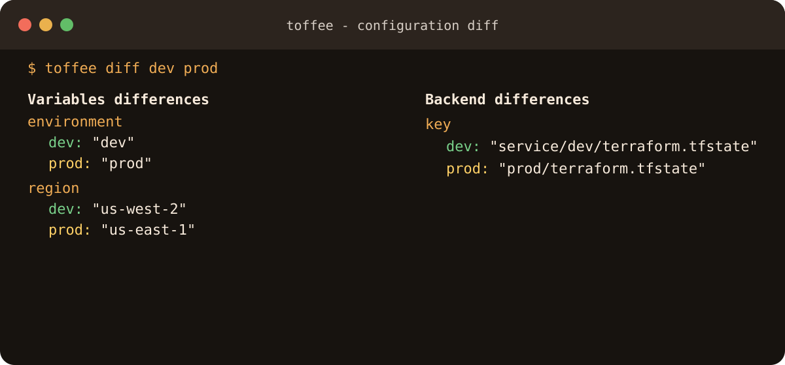

# Commands

## Terraform passthrough

```text
toffee <environment>[,<environment>...] <terraform-command> [terraform-args]
```

Terraform commands and arguments pass through unchanged. Toffee injects
`-backend-config=vars/<env>.tfbackend` for `init`,
`-var-file=vars/<env>.tfvars` where accepted, and an environment-specific
`TF_DATA_DIR`.

```bash
toffee dev init
toffee dev plan -target=aws_instance.web
toffee prod apply -auto-approve
toffee prod state list
toffee prod import aws_instance.web i-123
toffee dev providers schema -json
toffee dev -compact-warnings plan
```

Unknown Terraform commands are passed through too.

## Multiple environments

```bash
toffee dev,staging init
toffee dev,staging plan
toffee dev,staging plan --parallel
```

Sequential runs stop at the first failure. Parallel execution is opt-in;
`init` remains serialized because targets share `.terraform.lock.hcl`.
Interactive parallel commands are rejected. Parallel apply or destroy needs
Terraform's non-interactive approval flag. A saved plan and `plan -out` each
belong to one environment, so they cannot target multiple environments.

## Environment diff

```bash
toffee diff dev prod
toffee diff dev prod --exit-code
toffee diff dev prod --show-sensitive
```

The diff compares top-level variable and backend mappings without Terraform.
Sensitive-looking values are redacted unless `--show-sensitive` is used.
With `--exit-code`, status 1 means differences and status 2 means an error.


/// caption
Captured from `toffee diff dev prod`; only temporary example values are shown.
///

## Environment management

```bash
toffee env create dev
toffee env copy dev staging
toffee info envs
toffee info env staging
```

`env create` writes an empty pair. `env copy` copies and safely rewrites
environment values and state path segments; always review the result.

## Information and configuration

```bash
toffee info commands
toffee info version
toffee config show
toffee config init
toffee config set auto_approve true --project
```

`info env` reports paths, not environment file contents.

## Project scaffolding

```text
toffee new [DIRECTORY]
```

The only option is `--help`. See [Getting started](getting-started.md).
