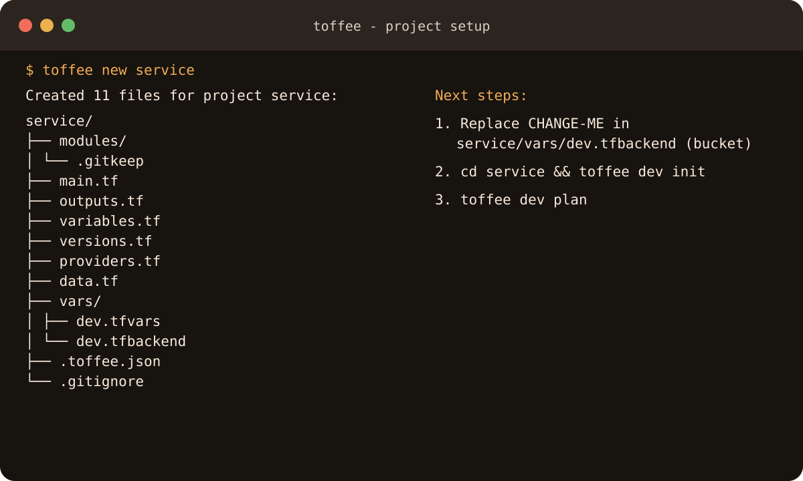

<section class="toffee-hero">
  <div>
    <p class="toffee-eyebrow">Environment-first Terraform</p>
    <h1>Ship infrastructure with the right environment in view.</h1>
    <p class="toffee-lede">Toffee selects each environment's variables, backend, and local Terraform data directory—then adds focused guardrails around production and saved plans.</p>
    <div class="toffee-actions">
      <a class="md-button md-button--primary" href="getting-started/">Install Toffee</a>
      <a class="md-button" href="getting-started/#create-your-first-project">Get started</a>
      <a class="md-button" href="https://github.com/akhileshmishrabiz/toffee-terraform-wrapper">GitHub</a>
    </div>
  </div>
  
</section>

## From zero to plan

```bash
toffee new service
cd service
# Edit vars/dev.tfbackend and replace CHANGE-ME.
toffee dev init
toffee dev plan
```

<div class="toffee-grid" markdown>
<article>
### Environment isolation
Each target gets paired variable and backend files plus its own `TF_DATA_DIR`.
</article>
<article>
### Production guardrails
Protected state changes require a separate Toffee confirmation. `-auto-approve` does not bypass it.
</article>
<article>
### Configuration diff
Compare environment mappings locally, with sensitive-looking values redacted by default.
</article>
<article>
### Saved-plan safety
Signed sidecars bind saved plans to an environment and file hash.
</article>
<article>
### Deterministic by design
Explicit targets, predictable argv injection, and useful exit codes make automation easier to reason about.
</article>
</div>

## A small command surface


/// caption
Actual Toffee 1.0.0 output, captured in an isolated temporary home.
///

Toffee keeps Terraform's commands and arguments intact:

```text
toffee <environment>[,<environment>...] <terraform-command> [terraform-args]
```

[Read the command reference](commands.md){ .md-button }
