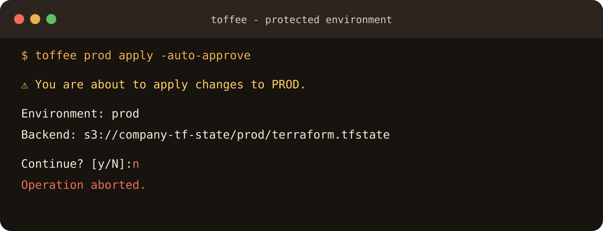

# Safety

## Protected environments

`prod`, `production`, and configured protected names require a separate Toffee
confirmation for state-changing commands, including apply, destroy, import,
refresh, state mutations, and workspace deletion.

```bash
toffee prod apply -auto-approve
```

Terraform's `-auto-approve` and Toffee's `auto_approve` setting do **not**
bypass this confirmation.


/// caption
Captured with a temporary project and example backend
`s3://company-tf-state/prod/terraform.tfstate`; the operation was aborted.
///

## Shared-state refusal

Before a command that can access state, Toffee compares all known environment
destinations. It refuses to continue when environments share state. It also
keeps each target's local Terraform metadata isolated with `TF_DATA_DIR`.

This check is a guardrail, not a reason to reuse state destinations. Give each
environment a unique backend key or path.

## Saved plans

After a successful `toffee <env> plan -out=FILE`, Toffee writes
`FILE.toffee.json`. The sidecar records the environment and plan SHA-256 and is
signed with a random per-user key at `~/.toffee/plan-signing.key`.

Toffee refuses a changed plan or a plan applied through a different
environment. A missing, malformed, unsigned, or unverifiable sidecar requires
confirmation. Moving a plan to another machine makes its signature
unverifiable unless that machine has the same trusted signing key; Toffee does
not silently trust the copied sidecar.

## Additional guarantees

- Incomplete `.tfvars` / `.tfbackend` pairs are rejected.
- `CHANGE-ME` backend values block `init`.
- Sequential multi-environment runs stop on failure.
- Interactive commands cannot run in parallel.
- Wrapper status goes to stderr, preserving Terraform stdout for pipelines.
- Toffee never generates or stores cloud credentials.
